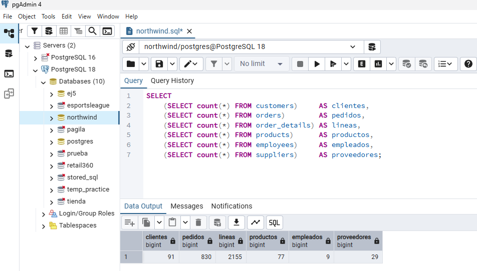
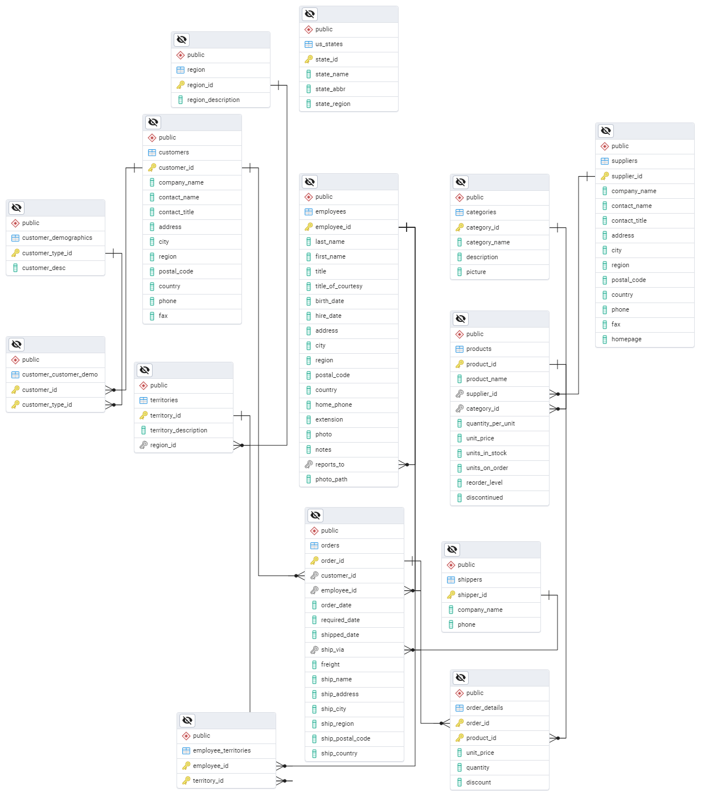

# Práctica 02 - Ejercicios Modelo SQL

**Autor:** Emmanuel Grande Sierra  

---

## Descripción

Práctica completa de SQL en PostgreSQL usando la base de datos **Northwind**. Incluye 20 ejercicios progresivos que cubren desde filtrados básicos hasta funciones de ventana avanzadas, subconsultas correlacionadas, CTEs y operadores de conjunto.

---

## Entorno de trabajo

- **PostgreSQL:** 18.x (Windows x86-64)
- **pgAdmin:** 4.x
- **Sistema operativo:** Windows 11

---

## Instalación y puesta en marcha

### 1. Instalación de PostgreSQL 18

Descarga el instalador desde [postgresql.org/download/windows](https://www.postgresql.org/download/windows/):

Verifica la instalación:

```powershell
psql -U postgres -c "SELECT version();"
```

### 2. Creación de la base de datos Northwind

**Opción 2: Por interfaz gráfica (recomendado)**

1. Abre pgAdmin 4
2. Conéctate al servidor PostgreSQL
3. Clic derecho en **Databases** → **Create** → **Database...**
4. **Pestaña General:** 
   - Database name = `northwind`
5. **Pestaña Definition:**
   - Encoding = `UTF8`
   - Template = `template0`
6. **Save**

**Alternativa - Por consulta SQL:**

```sql
CREATE DATABASE northwind
    WITH ENCODING  = 'UTF8'
         TEMPLATE  = template0;
```

**Verificación:**

```sql
SELECT datname, pg_encoding_to_char(encoding) AS codificacion
FROM pg_database
WHERE datname = 'northwind';
```

Resultado esperado:
```
 datname   | codificacion
-----------+--------------
 northwind | UTF8
```

### 3. Carga del script Northwind

1. Descarga `northwind.sql` desde el repositorio o desde la fuente oficial
2. Guarda el archivo en una ruta sin espacios ni tildes, ejemplo: `C:\bbdd\northwind.sql`
3. En pgAdmin:
   - Selecciona la base de datos **northwind** en el árbol izquierdo
   - Abre **Tools** -> **Query Tool**
   - Verifica que la pestaña diga `northwind/postgres@PostgreSQL 18`
   - Pulsa el icono de carpeta y abre `northwind.sql`
   - Ejecuta el script con **F5** o el botón ▶

### 4. Validación de la carga

Ejecuta esta consulta para verificar que las 14 tablas se cargaron correctamente:

```sql
SELECT
    (SELECT count(*) FROM customers)     AS clientes,
    (SELECT count(*) FROM orders)        AS pedidos,
    (SELECT count(*) FROM order_details) AS lineas,
    (SELECT count(*) FROM products)      AS productos,
    (SELECT count(*) FROM employees)     AS empleados,
    (SELECT count(*) FROM suppliers)     AS proveedores;
```

Resultado esperado:
```
 clientes | pedidos | lineas | productos | empleados | proveedores
----------+---------+--------+-----------+-----------+-------------
    91    |   830   |  2155  |     77    |     9     |     29
```



Si algún número difiere, vuelve a ejecutar el script completo.

---

## 📊 Diagrama Entidad-Relación



**Elementos clave del modelo:**

- **orders** y **order_details:** Núcleo transaccional (casi todas las consultas pasan por aquí)
- **order_details:** Tabla puente con clave primaria compuesta (order_id, product_id)
- **employees:** Auto-referencia a través de `reports_to` (jerarquía de mandos)
- **us_states:** Tabla aislada sin relaciones (no se usa en el modelo)
- **customer_demographics:** Tabla prevista pero sin datos

Puedes regenerar este diagrama en pgAdmin: clic derecho sobre la base de datos → **ERD For Database**.

---

**👉 [Ver soluciones completas de los ejercicios practicos en respuestas.md](respuestas.md)**

---
