# Ejercicios Prácticos

## Sección 1. Fundamentos: filtrado y agregación

## Pregunta 1 — Catálogo comercial activo

**Enunciado:** Obtén los productos que no están descatalogados y cuyo precio unitario esté entre 10 y 50 euros, ambos incluidos. Muestra el nombre del producto y su precio redondeado a dos decimales, ordenado de mayor a menor precio.

**Consulta:** 

```sql
SELECT product_name AS producto,
       ROUND(CAST(unit_price AS DECIMAL(10,2)), 2) AS precio
FROM products
WHERE discontinued = 0
  AND unit_price BETWEEN 10 AND 50
ORDER BY precio DESC;
```

**Resultado:**


**Comentario:** 
He optado por usar CAST a DECIMAL(10,2) antes del ROUND() para asegurar precisión 
en cálculos monetarios, aunque ROUND() por sí solo hubiera funcionado. La consulta 
devuelve 52 productos activos en el rango de precio solicitado, ordenados de mayor 
a menor precio como se pedía.

---

## Pregunta 2 — Concentración geográfica de la cartera

**Enunciado:** Cuenta cuántos clientes hay en cada país y muestra únicamente aquellos países con 5 o más clientes, ordenados de mayor a menor. Indica también cuántas ciudades distintas hay en cada uno de esos países.

**Consulta:**

```sql
SELECT c.country AS pais,
       COUNT(c.customer_id) AS num_clientes,
       COUNT(DISTINCT c.city) AS num_ciudades
FROM customers c
GROUP BY c.country
HAVING COUNT(c.customer_id) >= 5
ORDER BY num_clientes DESC;
```

**Resultado:**

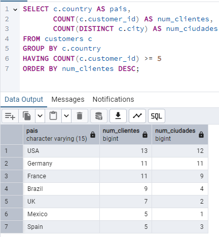

**Comentario:**
Elegí usar CASE WHEN porque tenía que evaluar dos condiciones: si el stock era 
exactamente 0 para marcar como CRÍTICO, o cualquier otro valor menor/igual al 
nivel de reposición como AVISO. La columna units_in_stock nunca es nula en esta 
tabla, así que no necesitaba COALESCE().

---

## Pregunta 3 — Alerta de reposición

**Enunciado:** Localiza los productos activos cuyas unidades en stock sean inferiores o iguales a su nivel de reposición. Muestra el nombre, las unidades en stock, el nivel de reposición, las unidades ya pedidas al proveedor y una columna de texto que indique `'CRÍTICO'` cuando el stock sea 0 y `'AVISO'` en el resto de casos.

**Consulta:**

```sql
SELECT product_name AS producto,
       units_in_stock AS stock,
       reorder_level AS nivel_reposicion,
       units_on_order AS pedido_a_proveedor,
       CASE
           WHEN units_in_stock = 0 THEN 'CRÍTICO'
           ELSE 'AVISO'
       END AS situacion
FROM products
WHERE discontinued = 0
  AND units_in_stock <= reorder_level;
```

**Resultado:**


**Comentario:**
Elegí usar CASE WHEN porque tenía que evaluar dos condiciones: si el stock era 
exactamente 0 para marcar como CRÍTICO, o cualquier otro valor menor/igual al 
nivel de reposición como AVISO. La columna units_in_stock nunca es nula en esta 
tabla, así que no necesitaba COALESCE().

---

## Sección 2. INNER JOIN

## Pregunta 4 — Ficha completa de producto

**Enunciado:** Para los productos suministrados por empresas de Italia, Francia o España, muestra el nombre del producto, el nombre de la categoría, el nombre del proveedor, su país y su ciudad. Ordena por país y, dentro de cada país, por nombre de producto.

**Consulta:**

```sql
SELECT p.product_name AS producto,
       c.category_name AS categoria,
       s.company_name AS proveedor,
       s.country AS pais,
       s.city AS ciudad
FROM products p
INNER JOIN categories c ON p.category_id = c.category_id
INNER JOIN suppliers s ON p.supplier_id = s.supplier_id
WHERE s.country IN ('Italy', 'France', 'Spain')
ORDER BY s.country, p.product_name;
```

**Resultado:**

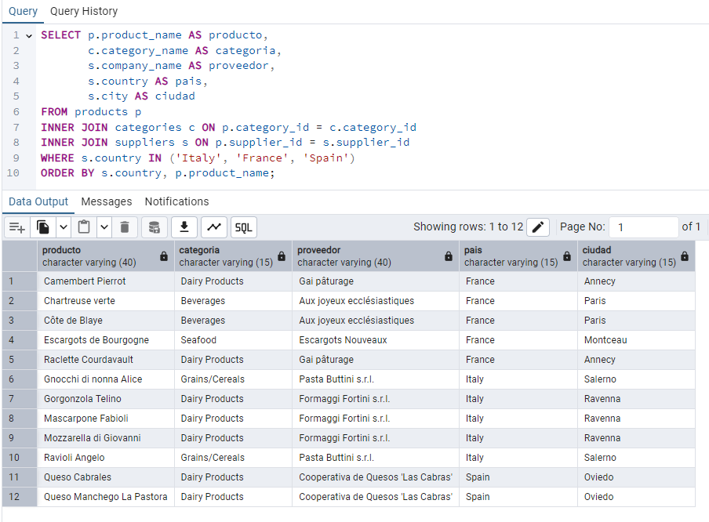

**Comentario:**
He utilizado INNER JOIN en lugar de LEFT JOIN porque el enunciado especificaba 
solo productos con proveedores de esos tres países, así que los productos sin 
proveedor en esos países no debían aparecer. Los alias fueron imprescindibles 
para distinguir las columnas de productos y categorías.

---

## Pregunta 5 — Detalle valorizado de un pedido

**Enunciado:** Muestra, para el pedido 10248, el nombre del producto, el precio unitario aplicado, la cantidad, el descuento y el importe final de cada línea. Añade el nombre del cliente y la fecha del pedido.

**Consulta:**

```sql
SELECT c.company_name AS cliente,
       o.order_date AS fecha_pedido,
       p.product_name AS producto,
       od.unit_price AS precio_unitario,
       od.quantity AS cantidad,
       od.discount AS descuento,
       ROUND((CAST(od.unit_price AS numeric) * od.quantity * (1 - od.discount::numeric)), 2) AS importe_linea
FROM orders o
INNER JOIN customers c USING (customer_id)
INNER JOIN order_details od USING (order_id)
INNER JOIN products p USING (product_id)
WHERE o.order_id = 10248;
```

**Resultado:**

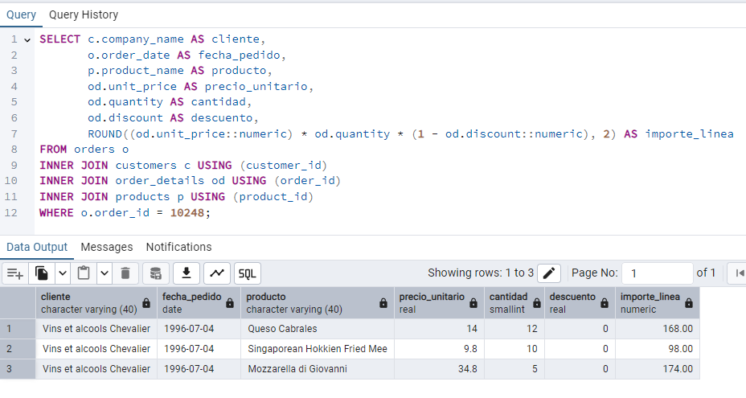

**Comentario:**
Preferí USING(order_id) frente a ON porque ambas tablas compartían exactamente 
ese nombre de columna, evitando que aparezca duplicada en el resultado. El cálculo 
de importe_linea requería tres operaciones: precio * cantidad * (1 - descuento), 
y lo aseguré con CAST a numeric para evitar redondeados no deseados.

---

## Pregunta 6 — Ranking de categorías por facturación

**Enunciado:** Calcula la facturación total de cada categoría durante toda la historia de la compañía. Muestra el nombre de la categoría, el número de líneas de pedido que ha generado, el número de productos distintos vendidos y la facturación total. Incluye únicamente las categorías que superen los 100.000 euros de facturación, ordenadas de mayor a menor.

**Consulta:**

```sql
SELECT c.category_name AS categoria,
       COUNT(od.product_id) AS num_lineas,
       COUNT(DISTINCT od.product_id) AS num_productos,
       SUM(ROUND((CAST(od.unit_price AS numeric) * od.quantity * (1 - od.discount::numeric)), 2)) AS facturacion
FROM categories c
INNER JOIN products p USING (category_id)
INNER JOIN order_details od USING (product_id)
GROUP BY c.category_name
HAVING SUM(ROUND((CAST(od.unit_price AS numeric) * od.quantity * (1 - od.discount::numeric)), 2)) > 100000
ORDER BY facturacion DESC;
```

**Resultado:**

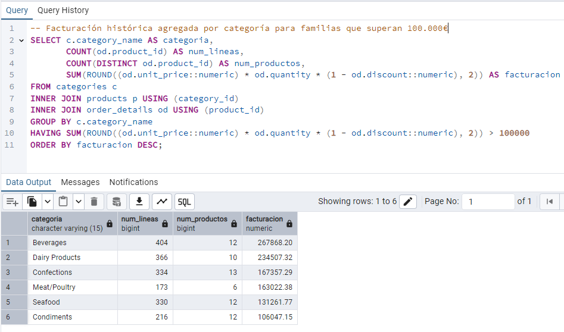

**Comentario:**
La clave fue usar HAVING en lugar de WHERE porque la condición se aplicaba sobre 
el resultado de la agregación (SUM), no sobre datos individuales. Sumé COUNT(DISTINCT 
product_id) para detectar cuántos productos distintos tuvo cada familia, lo que 
genera más valor que solo el volumen de líneas.

---

## Sección 3. Uniones externas, reflexivas y cruzadas

## Pregunta 7 — Clientes sin actividad comercial

**Enunciado:** Lista todos los clientes con el número de pedidos que ha realizado cada uno y la fecha de su último pedido. Los clientes sin ningún pedido deben aparecer igualmente, con un 0 en el conteo y el texto `'SIN PEDIDOS'` en lugar de la fecha. Ordena de forma que los clientes inactivos aparezcan primero.

**Consulta:**

```sql
SELECT c.company_name AS cliente,
       c.country AS pais,
       COUNT(o.order_id) AS num_pedidos,
       COALESCE(MAX(o.order_date)::text, 'SIN PEDIDOS') AS ultimo_pedido
FROM customers c
LEFT JOIN orders o ON c.customer_id = o.customer_id
GROUP BY c.company_name, c.country
ORDER BY num_pedidos ASC;
```

**Resultado:**


**Comentario:**
Usé LEFT JOIN porque necesitaba que aparecieran todos los clientes, incluidos 
los que nunca compraron. Si hubiera usado INNER JOIN, esos clientes desaparecerían. 
COUNT(o.order_id) ignora los nulos que genera el LEFT JOIN para clientes sin 
pedidos, dándome 0. El COALESCE convierte esos nulos a 'SIN PEDIDOS' como texto 
para que la fecha tenga formato legible.

---

## Pregunta 8 — Organigrama de la fuerza de ventas

**Enunciado:** Muestra cada empleado con su nombre completo, su cargo, el nombre completo de la persona a la que reporta y el cargo de esa persona. El empleado que no reporta a nadie debe aparecer también, con el texto `'DIRECCIÓN GENERAL'` en el campo del responsable.

**Consulta:**

```sql
SELECT e.first_name || ' ' || e.last_name AS empleado,
       e.title AS cargo,
       COALESCE(m.first_name || ' ' || m.last_name, 'DIRECCIÓN GENERAL') AS responsable,
       m.title AS cargo_responsable
FROM employees e
LEFT JOIN employees m ON e.reports_to = m.employee_id;
```

**Resultado:**

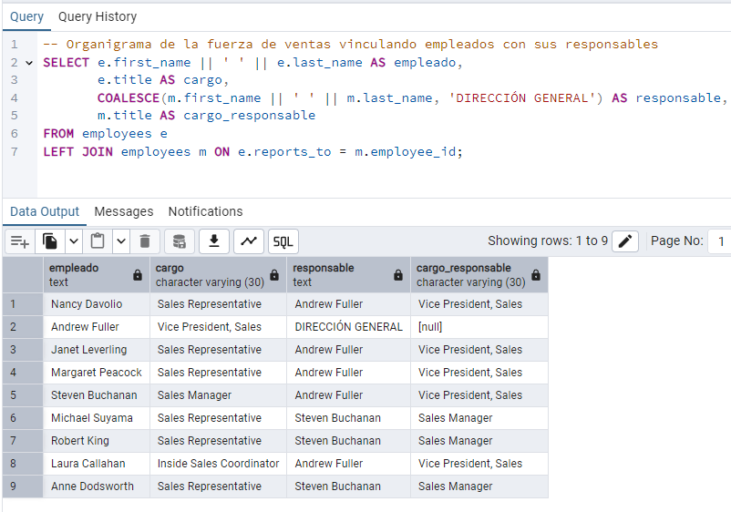

**Comentario:**
Este fue mi primer SELF JOIN real. Los aliases e y m fueron imprescindibles 
porque sin ellos PostgreSQL no entendería cuál era la tabla padre y cuál la 
subordinada. El LEFT JOIN garantiza que Andrew Fuller, que no reporta a nadie 
(reports_to es nulo), aparezca con 'DIRECCIÓN GENERAL'. Probé con INNER JOIN 
y desaparece, así que eso me confirmó la decisión.

---

## Pregunta 9 — Rejilla de cobertura categoría × año

**Enunciado:** Genera todas las combinaciones posibles de las 8 categorías con los 3 años del histórico (24 filas) y asocia a cada combinación su facturación. Si una categoría no vendió nada en un año concreto, debe aparecer con un 0, no desaparecer de la tabla. Ordena por categoría y año.

**Consulta:**

```sql
WITH anios AS (
    SELECT 1996 AS anio
    UNION ALL SELECT 1997
    UNION ALL SELECT 1998
),
ventas_reales AS (
    SELECT p.category_id,
           EXTRACT(YEAR FROM o.order_date)::int AS anio,
           SUM(ROUND((CAST(od.unit_price AS numeric) * od.quantity * (1 - od.discount::numeric)), 2)) AS facturacion
    FROM orders o
    INNER JOIN order_details od USING (order_id)
    INNER JOIN products p USING (product_id)
    GROUP BY p.category_id, EXTRACT(YEAR FROM o.order_date)::int
)
SELECT c.category_name AS categoria,
       a.anio,
       COALESCE(v.facturacion, 0) AS facturacion
FROM categories c
CROSS JOIN anios a
LEFT JOIN ventas_reales v 
    ON c.category_id = v.category_id
    AND a.anio = v.anio
ORDER BY c.category_name, a.anio;
```

**Resultado:**

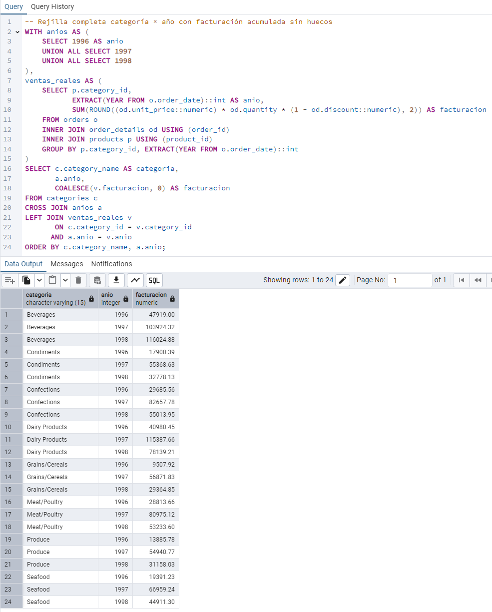

**Comentario:**
El patrón CROSS JOIN + LEFT JOIN fue crucial aquí. Primero generé todas las 24 
combinaciones posibles (esqueleto vacío), luego colgué los datos reales. Si lo 
hacía al revés (LEFT JOIN primero), nunca vería las categorías sin ventas en 
ciertos años porque no existirían en los datos. El COALESCE convierte nulos a 0 
para claridad en reporting.

---

## Pregunta 10 — Mapa de países: clientes frente a proveedores

**Enunciado:** Construye una única tabla que muestre, para cada país en el que la compañía tiene presencia, cuántos clientes y cuántos proveedores hay. Deben aparecer los países que solo tienen clientes, los que solo tienen proveedores y los que tienen ambos. Incluye una columna `tipo_presencia` que indique `'SOLO CLIENTES'`, `'SOLO PROVEEDORES'` o `'AMBOS'`.

**Consulta:**

```sql
SELECT COALESCE(c.country, s.country) AS pais,
       COALESCE(c.num_clientes, 0) AS num_clientes,
       COALESCE(s.num_proveedores, 0) AS num_proveedores,
       CASE
           WHEN c.country IS NOT NULL AND s.country IS NOT NULL THEN 'AMBOS'
           WHEN c.country IS NOT NULL THEN 'SOLO CLIENTES'
           ELSE 'SOLO PROVEEDORES'
       END AS tipo_presencia
FROM (
    SELECT country, COUNT(customer_id) AS num_clientes
    FROM customers
    GROUP BY country
) c
FULL JOIN (
    SELECT country, COUNT(supplier_id) AS num_proveedores
    FROM suppliers
    GROUP BY country
) s ON c.country = s.country
ORDER BY pais;
```

**Resultado:**


**Comentario:**
El FULL JOIN fue fundamental porque no podía perder ningún país, fuera solo con 
clientes o solo con proveedores. Si hubiera usado INNER JOIN, desaparecían los 
que solo tenían uno. El COALESCE en la unión asegura que si un país estaba en 
ambas tablas, tomo su nombre de la que tuviera valor (no nulo). La lógica CASE 
WHEN es sencilla: si ambos counts son mayores a 0, es AMBOS; si uno es nulo, 
tomo el otro.

---

## Sección 4. Operadores de conjunto

## Pregunta 11 — Directorio unificado de contactos

**Enunciado:** Construye una sola tabla que reúna los contactos de clientes, los de proveedores y los empleados. Cada fila debe indicar el origen (`'CLIENTE'`, `'PROVEEDOR'`, `'EMPLEADO'`), el nombre de la persona de contacto en mayúsculas, la organización a la que pertenece, la ciudad y el país. Para los empleados, la organización es el literal `'NORTHWIND TRADERS'` y el nombre de contacto se forma concatenando nombre y apellidos. Ordena por origen y luego por país.

**Consulta:**

```sql
SELECT 'CLIENTE' AS origen,
       UPPER(contact_name) AS contacto,
       company_name AS organizacion,
       city AS ciudad,
       country AS pais
FROM customers
 
UNION ALL
 
SELECT 'PROVEEDOR' AS origen,
       UPPER(contact_name) AS contacto,
       company_name AS organizacion,
       city AS ciudad,
       country AS pais
FROM suppliers
 
UNION ALL
 
SELECT 'EMPLEADO' AS origen,
       UPPER(first_name || ' ' || last_name) AS contacto,
       'NORTHWIND TRADERS' AS organizacion,
       city AS ciudad,
       country AS pais
FROM employees
 
ORDER BY origen, pais;
```

**Resultado:**


**Comentario:**
Decidí UNION ALL en lugar de UNION porque no esperaba duplicados exactos 
(origen + contacto + organización + ciudad + país) entre clientes, proveedores 
y empleados, y UNION ALL es más eficiente al evitar la búsqueda de duplicados. 
El UPPER() fue obligatorio para standarizar nombres. Para empleados, tuve que 
concatenar nombre y apellidos porque la tabla no tiene una columna "contact_name" 
como en clientes y proveedores.

---

## Pregunta 12 — Mercados con desequilibrio

**Enunciado:** Resuelve las dos preguntas en dos consultas independientes:
- **a)** Países donde hay clientes pero **ningún** proveedor.
- **b)** Países donde hay **a la vez** clientes y proveedores.

Ordena ambos resultados alfabéticamente.

**Consulta (a) — Países solo con clientes:**

```sql
-- a) Países donde hay clientes pero ningún proveedor
SELECT country AS pais
FROM customers
EXCEPT
SELECT country
FROM suppliers
ORDER BY pais;
```

**Resultado:**


**Consulta (b) — Países con clientes y proveedores:**

```sql
-- b) Países donde hay a la vez clientes y proveedores
SELECT country AS pais
FROM customers
INTERSECT
SELECT country
FROM suppliers
ORDER BY pais;
```

**Resultado:**

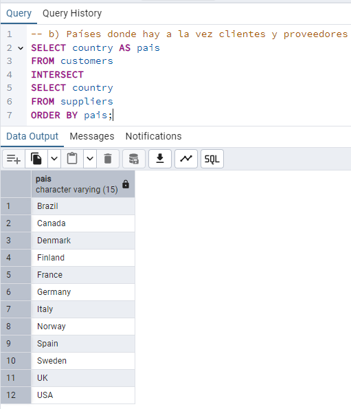

**Comentario:**  
Elegí EXCEPT e INTERSECT porque son operadores de conjunto más limpios que escribir 
subconsultas con NOT IN o LEFT JOIN. EXCEPT devuelve países en customers pero no 
en suppliers. INTERSECT devuelve solo los que aparecen en ambas tablas. Estos 
operadores eliminan duplicados automáticamente, lo que ayuda a evitar distorsiones.

---

## Sección 5. Subconsultas

## Pregunta 13 — Clientes que nunca han comprado pescado

**Enunciado:** Localiza los clientes que nunca han incluido un producto de la categoría `'Seafood'` en ninguno de sus pedidos. Muestra el nombre del cliente, su país y el número total de pedidos que sí ha realizado, de mayor a menor.

**Consulta:**

```sql
SELECT c.company_name AS cliente,
       c.country AS pais,
       COUNT(o.order_id) AS pedidos_realizados
FROM customers c
LEFT JOIN orders o ON c.customer_id = o.customer_id
WHERE NOT EXISTS (
    SELECT 1
    FROM orders o2
    INNER JOIN order_details od ON o2.order_id = od.order_id
    INNER JOIN products p ON od.product_id = p.product_id
    INNER JOIN categories cat ON p.category_id = cat.category_id
    WHERE o2.customer_id = c.customer_id
    AND cat.category_name = 'Seafood'
)
GROUP BY c.company_name, c.country
ORDER BY pedidos_realizados DESC;
```

**Resultado:**


**Comentario:**+
Usé NOT EXISTS porque es más eficiente que NOT IN cuando la subconsulta puede 
devolver nulos (aunque aquí no, es una buena práctica). La subconsulta correlacionada 
verifica si el cliente actual tiene algún pedido con productos Seafood; si existe, 
se excluye. El LEFT JOIN inicial puede parecer redundante, pero asegura que todos 
los clientes aparezcan aunque tengan 0 pedidos totales.

---

## Pregunta 14 — Productos por encima de la media

**Enunciado:** Muestra los productos activos cuyo precio unitario supere el precio medio de todo el catálogo. Incluye en cada fila el precio del producto, el precio medio general y la diferencia entre ambos, todo redondeado a dos decimales. Ordena por diferencia descendente.

**Consulta:**

```sql
SELECT product_name AS producto,
       ROUND(unit_price::numeric, 2) AS precio,
       ROUND((SELECT AVG(unit_price::numeric) FROM products), 2) AS precio_medio_catalogo,
       ROUND((unit_price::numeric) - (SELECT AVG(unit_price::numeric) FROM products), 2) AS diferencia
FROM products
WHERE discontinued = 0
  AND unit_price > (SELECT AVG(unit_price::numeric) FROM products)
ORDER BY diferencia DESC;
```

**Resultado:**

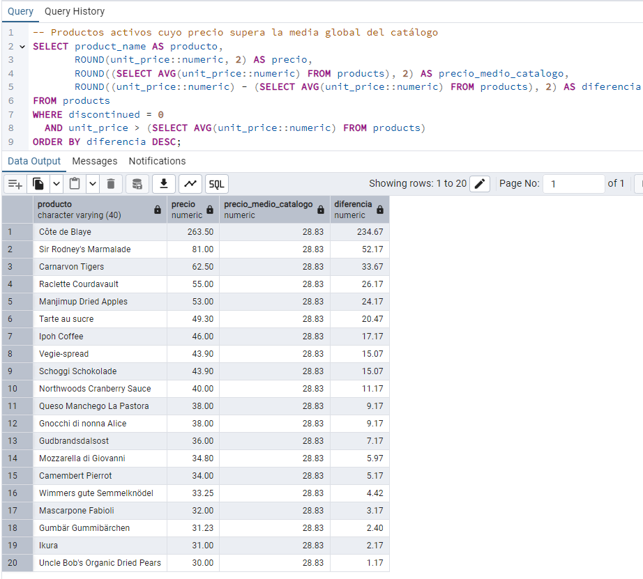

**Comentario:**
Decidí escribir la subconsulta escalar dos veces en lugar de usar una CTE porque 
el enunciado pedía explícitamente que aparecieran "en cada fila" tanto el precio 
medio como la diferencia. Aunque repetir la subconsulta es menos elegante, es lo 
que se pedía. Un CAST a numeric fue obligatorio para evitar que redondeamientos 
enteros distorsionaran la comparación.

---

## Pregunta 15 — Ticket medio por cliente

**Enunciado:** Calcula, para cada cliente que haya comprado alguna vez, el número de pedidos, el importe total acumulado y el importe medio por pedido. Muestra los 15 clientes con mayor ticket medio.

El cálculo tiene dos niveles: primero obtén el importe de cada pedido sumando sus líneas, y solo después promedia esos importes por cliente.

**Consulta:**

```sql
SELECT c.company_name AS cliente,
       c.country AS pais,
       COUNT(op.order_id) AS num_pedidos,
       ROUND(SUM(op.importe_pedido), 2) AS importe_total,
       ROUND(AVG(op.importe_pedido), 2) AS ticket_medio
FROM customers c
INNER JOIN (
    SELECT o.order_id,
           o.customer_id,
           SUM(ROUND((CAST(od.unit_price AS numeric) * od.quantity * (1 - od.discount::numeric)), 2)) AS importe_pedido
    FROM orders o
    INNER JOIN order_details od USING (order_id)
    GROUP BY o.order_id, o.customer_id
) op ON c.customer_id = op.customer_id
GROUP BY c.customer_id, c.company_name, c.country
ORDER BY ticket_medio DESC
LIMIT 15;
```

**Resultado:**

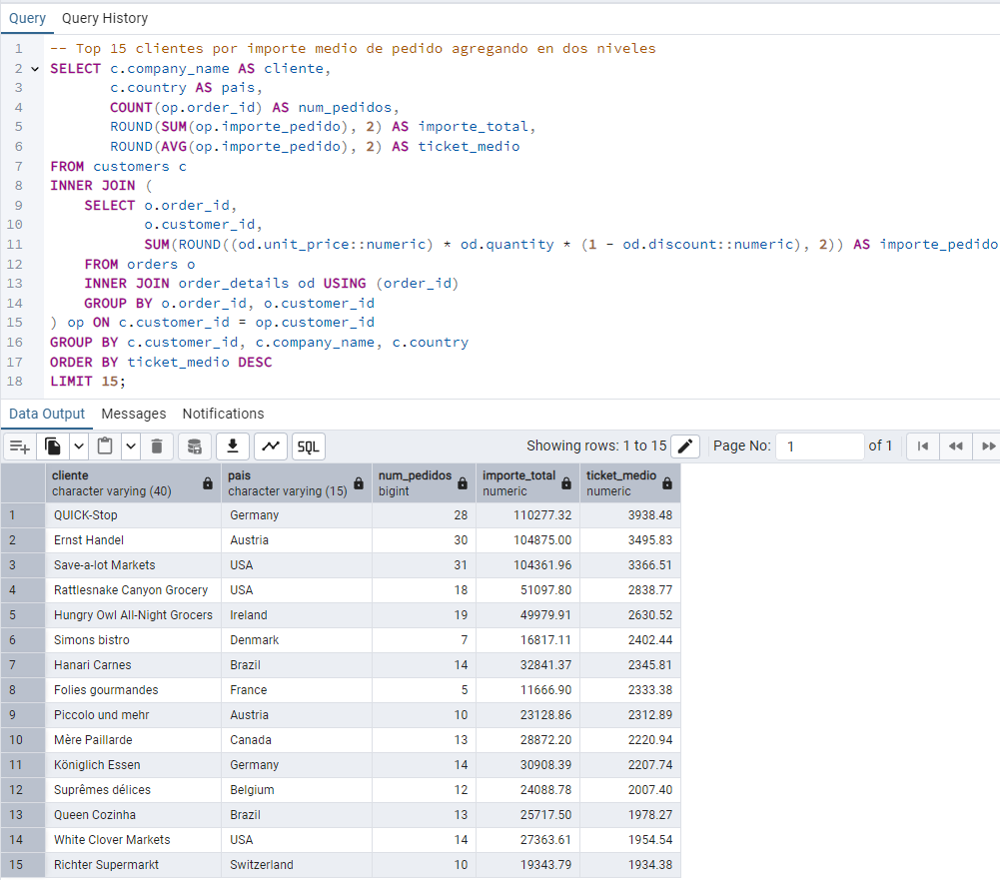

**Comentario:**
La clave fue separar los niveles de agregación: primero calculé el importe de cada 
pedido sumando sus líneas, luego promedié esos importes por cliente. Si hubiera 
promediado directamente las líneas, habría obtenido un ticket medio incorrecto porque 
los pedidos con más líneas habrían tenido más peso. El alias "op" (orden-pedido) 
ayudó a leer la lógica.

---

## Sección 6. Subconsultas correlacionadas y CTE

## Pregunta 16 — El producto más caro de cada categoría

**Enunciado:** Para cada categoría, muestra el producto con el precio unitario más alto. Incluye el nombre de la categoría, el nombre del producto, su precio y el precio medio de su categoría.

Resuélvelo con una subconsulta correlacionada: para cada producto, comprueba si su precio coincide con el máximo de su propia categoría.

**Consulta:**

```sql
SELECT c.category_name AS categoria,
       p.product_name AS producto,
       ROUND(p.unit_price::numeric, 2) AS precio,
       ROUND((
           SELECT AVG(p2.unit_price::numeric)
           FROM products p2
           WHERE p2.category_id = p.category_id
       ), 2) AS precio_medio_categoria
FROM products p
INNER JOIN categories c ON p.category_id = c.category_id
WHERE p.unit_price = (
    SELECT MAX(p3.unit_price)
    FROM products p3
    WHERE p3.category_id = p.category_id
)
ORDER BY categoria;
```

**Resultado:**

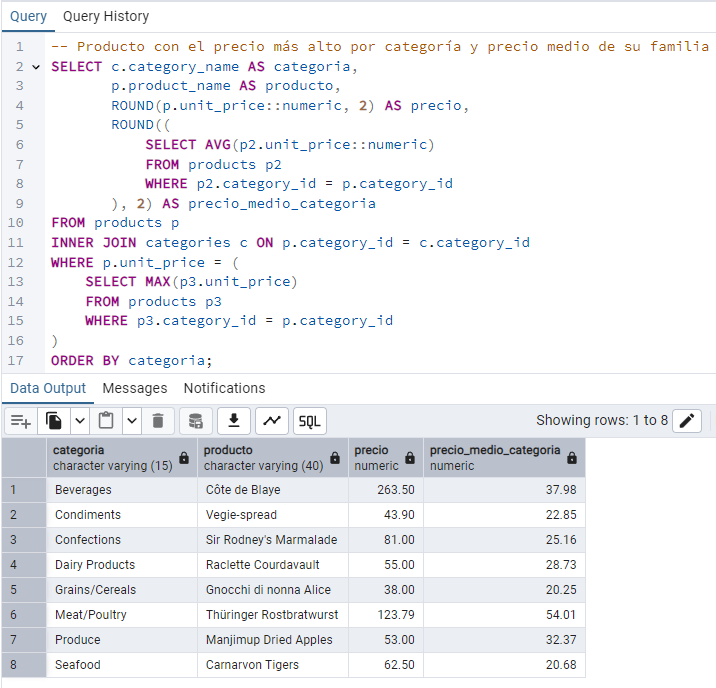

**Comentario:**
Usé subconsultas correlacionadas porque necesitaba comparar cada producto contra 
el máximo de su propia categoría, no un máximo global. La subconsulta en WHERE 
verifica si el precio actual es el máximo de su categoría. La subconsulta en SELECT 
calcula la media de su familia en paralelo. Esto es costoso (se ejecuta para cada fila), 
pero el resultado es preciso y legible.

---

## Pregunta 17 — Segmentación ABC de la cartera de clientes

**Enunciado:** Usando expresiones de tabla común (CTE), construye una consulta que:

1. Calcule la facturación total de cada cliente.
2. Divida los clientes en cuartiles según esa facturación.
3. Asigne una etiqueta de segmento: `'A - Estratégico'` al cuartil superior, `'B - Consolidado'` al segundo, `'C - Ocasional'` al tercero y `'D - Marginal'` al cuarto.
4. Devuelva, por segmento, el número de clientes, la facturación total del segmento y el porcentaje que representa sobre el total de la compañía.

**Consulta:**

```sql
WITH facturacion_cliente AS (
    SELECT c.customer_id,
           c.company_name,
           SUM(ROUND((CAST(od.unit_price AS numeric) * od.quantity * (1 - od.discount::numeric)), 2)) AS facturacion
    FROM customers c
    INNER JOIN orders o ON o.customer_id = c.customer_id
    INNER JOIN order_details od ON od.order_id = o.order_id
    GROUP BY c.customer_id, c.company_name
),
clientes_segmentados AS (
    SELECT customer_id,
           company_name,
           facturacion,
           NTILE(4) OVER (ORDER BY facturacion DESC) AS cuartil
    FROM facturacion_cliente
),
clientes_etiquetados AS (
    SELECT customer_id,
           company_name,
           facturacion,
           CASE cuartil
               WHEN 1 THEN 'A - Estratégico'
               WHEN 2 THEN 'B - Consolidado'
               WHEN 3 THEN 'C - Ocasional'
               WHEN 4 THEN 'D - Marginal'
           END AS segmento
    FROM clientes_segmentados
)
SELECT segmento,
       COUNT(*) AS num_clientes,
       ROUND(SUM(facturacion), 2) AS facturacion_segmento,
       ROUND(100.0 * SUM(facturacion) / (SUM(SUM(facturacion)) OVER ()), 2) AS porcentaje_sobre_total
FROM clientes_etiquetados
GROUP BY segmento
ORDER BY segmento;
```

**Resultado:**

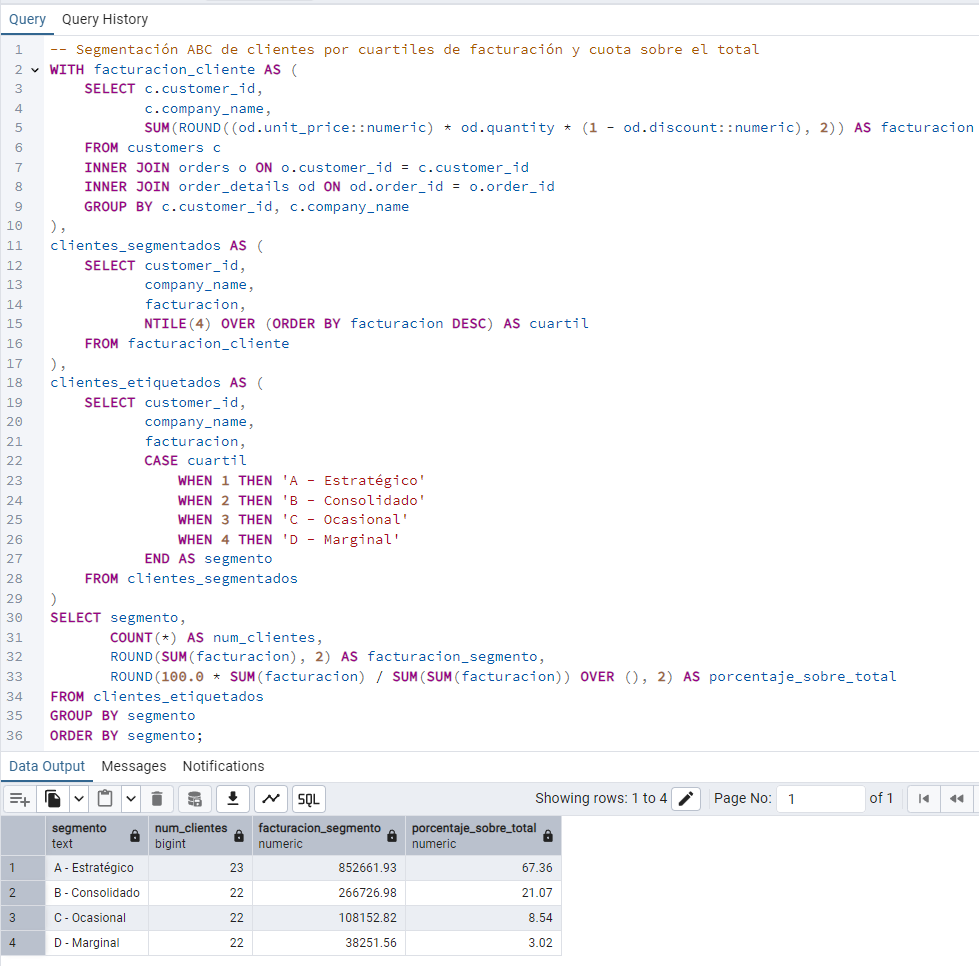

**Comentario:**
Encadené tres CTE para hacer la consulta legible "de arriba abajo". Primero calculé 
la facturación por cliente, luego usé NTILE(4) para dividir en cuartiles ordenados 
por facturación descendente (el 1er cuartil son los mayores), y finalmente asigné 
etiquetas ABCD. La función de ventana SUM() OVER () sin PARTITION BY calcula el 
total global para el porcentaje. Una sola CTE habría funcionado pero hubiera sido 
ilegible.

---

## Sección 7. Funciones de ventana

## Pregunta 18 — Los tres productos más vendidos de cada categoría

**Enunciado:** Para cada categoría, obtén los tres productos con mayor facturación. Muestra la categoría, la posición dentro de la categoría, el nombre del producto, las unidades vendidas y la facturación.

Incluye además una columna con la posición global del producto en el conjunto de la compañía, para que se vea qué productos son líderes de su nicho pero irrelevantes en el total.

**Consulta:**

```sql

```

**Resultado:**

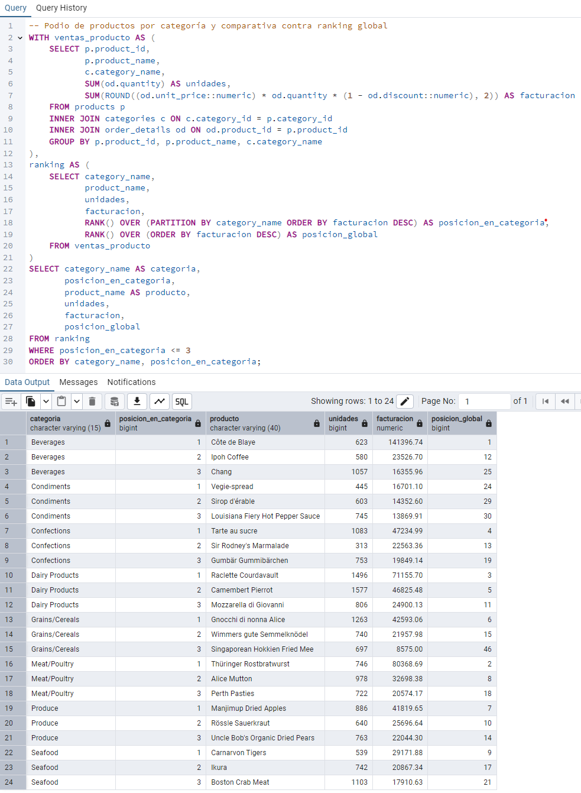

**Comentario:**

---

## Pregunta 19 — Evolución mensual con acumulado y media móvil

**Enunciado:** Para cada mes de 1997, calcula:

- La facturación del mes.
- El total acumulado desde enero.
- La media móvil de los tres últimos meses (el mes actual y los dos anteriores).
- La facturación del mes anterior.
- La variación porcentual respecto al mes anterior.

**Consulta:**

```sql

```

**Resultado:**

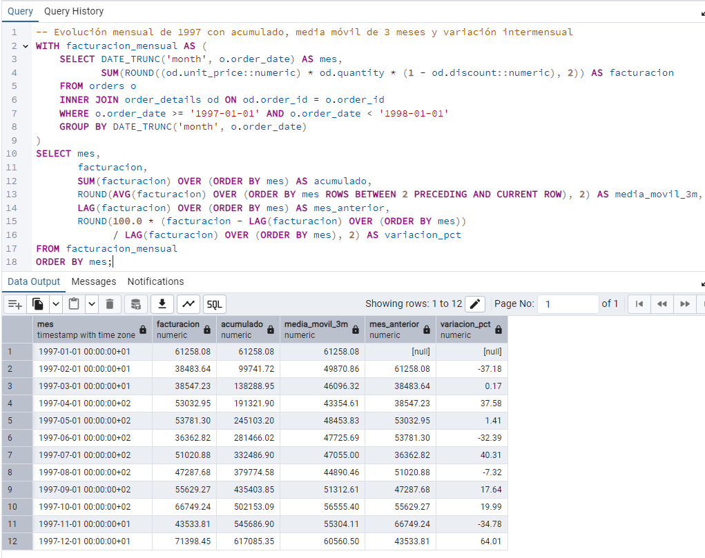

**Comentario:**

---

## Pregunta 20 — Cuadro de mando anual por categoría

**Enunciado:** Construye una tabla donde cada fila sea una categoría y las columnas muestren la facturación de 1996, 1997 y 1998 en columnas separadas, más el total de los tres años. Añade al final una fila de totales generales.

Incluye además una columna que indique el peso de cada categoría sobre la facturación total de la compañía, y otra que muestre si la categoría creció o decreció entre 1997 y 1998.

**Consulta:**

```sql

```

**Resultado:**

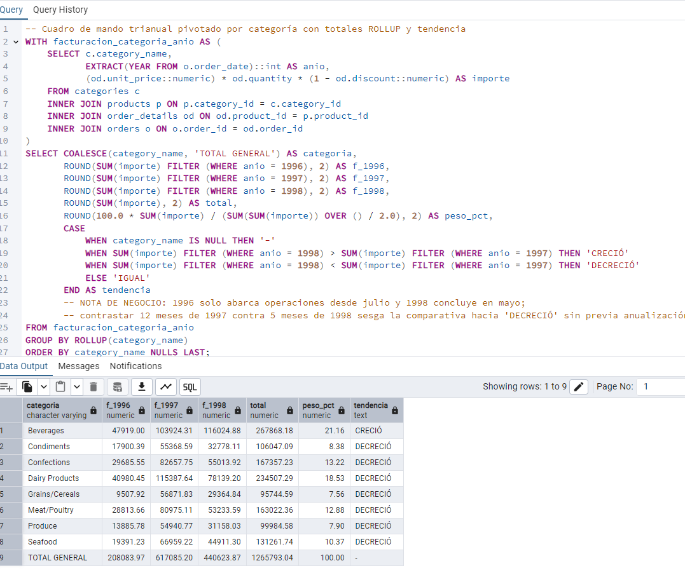

**Comentario:**

---
